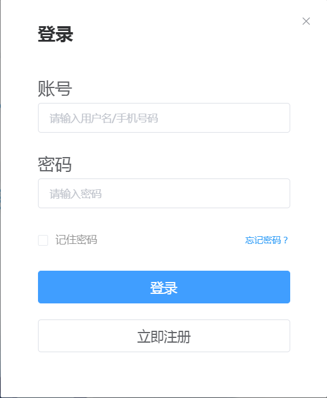
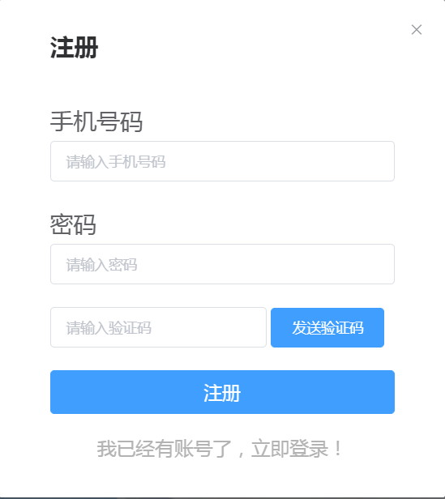
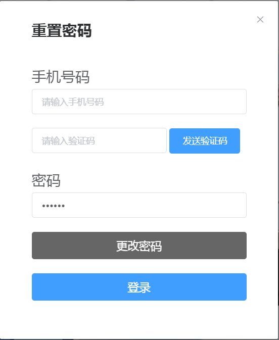

# 用户模块

---

（包含登录，注册，重置密码）

---

::: warning
获取验证码请看[获取验证码](./verfication.html)模块
:::

## 登录



## 注册



## 重置密码



---

## 实践

<loginDemo/>

## 源码

登录，注册，重置密码(只需要替换逻辑即可)

``` vue
<template>
  <div>
    <el-dialog
      :title="title"
      width="440px"
      style="font-size:27px;min-width: 420px;"
      custom-class="loginCss"
      :visible="dialogVisible"
      @close="closeBox"
    >
      <!-- 登录 -->
      <el-form v-if="showLogn" ref="loginform" :model="user">
        <el-form-item label="账号" prop="username">
          <el-input
            placeholder="请输入用户名/手机号码"
            v-model="user.username"
          ></el-input>
        </el-form-item>
        <el-form-item label="密码" prop="password">
          <el-input
            placeholder="请输入密码"
            type="password"
            v-model="user.password"
          ></el-input>
        </el-form-item>
        <el-form-item>
          <div style="display:flex;justify-content:space-between">
            <el-checkbox
              @change="remember"
              v-model="checked"
              style="color:#666666;font-size:12px;opacity:0.73;"
              >记住密码</el-checkbox
            >
            <span
              @click="goReset"
              style="color:#2799F7;font-size:12px;cursor:pointer"
              >忘记密码？</span
            >
          </div>
        </el-form-item>
        <el-form-item>
          <div>
            <el-button
              type="primary"
              style="width:100%;font-size:18px;"
              @click="loginFun"
              @keyup.enter.native="loginFun"
              >登录</el-button
            >
          </div>
        </el-form-item>
        <el-form-item>
          <el-button style="width:100%;font-size:18px;" @click="goRegister"
            >立即注册</el-button
          >
        </el-form-item>
      </el-form>
      <!-- 登录 -->
      <!-- 注册 -->
      <el-form v-if="showRegister" ref="resetForm" :model="user">
        <el-form-item label="手机号码" prop="phone">
          <el-input
            placeholder="请输入手机号码"
            v-model="user.phone"
          ></el-input>
        </el-form-item>
        <el-form-item label="密码" prop="password">
          <el-input
            placeholder="请输入密码"
            type="password"
            v-model="user.password"
          ></el-input>
        </el-form-item>
        <el-form-item>
          <el-input
            placeholder="请输入验证码"
            style="width:63%;"
            v-model="user.code"
          ></el-input>
          <Veri :phone="user.phone" msType="1"></Veri>
        </el-form-item>
        <el-form-item>
          <div>
            <el-button
              type="primary"
              style="width:100%;font-size:18px;"
              @click="registerUser('resetForm')"
              >注册</el-button
            >
          </div>
        </el-form-item>
        <div class="ct" @click="goLogin">
          <a style="color:#B3B3B3;font-size:19px;font-weight:500;cursor:pointer"
            >我已经有账号了，立即登录！</a
          >
        </div>
      </el-form>
      <!-- 注册 -->
      <!-- 忘记密码 -->
      <el-form v-if="showReset" ref="form" :model="user">
        <el-form-item label="手机号码" prop="account">
          <el-input
            placeholder="请输入手机号码"
            v-model="user.phone"
          ></el-input>
        </el-form-item>
        <el-form-item>
          <el-input
            placeholder="请输入验证码"
            style="width:63%;"
            v-model="user.code"
          ></el-input>
          <Veri :phone="user.phone" msType="2"></Veri>
        </el-form-item>
        <el-form-item label="密码" prop="pwd">
          <el-input
            placeholder="请输入密码"
            type="password"
            v-model="user.password"
          ></el-input>
        </el-form-item>
        <el-form-item>
          <el-button
            type="primary"
            style="width:100%;font-size:18px;background-color:#666666;border-color:#666666;"
            @click="submit"
            >更改密码</el-button
          >
        </el-form-item>
        <el-form-item>
          <el-button
            type="primary"
            @click="goLogin"
            style="width:100%;font-size:18px;"
            >登录</el-button
          >
        </el-form-item>
      </el-form>
      <!-- 忘记密码 -->
    </el-dialog>
  </div>
</template>

<script>
// 案例
// import Bus from "@/utils/eventBus";
// import Veri from "@/components/Verification";
// import docCookies from "@/utils/index";
// import { login, register, resetPwd } from "@/api/login";
// import { setToken, removeToken, getToken } from "@/utils/auth";
// 演示
import Veri from "./Verification";
import docCookies from "../utils.js";
export default {
  components: {
    Veri
  },
  props: {
    dialogVisible: {
      type: Boolean //是否显示登录层
    }
  },
  data() {
    return {
      checked: false, //是否记住密码
      user: {}, //用户信息
      showRegister: false, //显示注册
      showReset: false, //显示重置密码
      showLogn: true, //显示登录
      title: "登录"
    };
  },
  created() {
    let bool = docCookies.hasItem("isChecked");
    if (bool) {
      this.checked = true;
      this.user.username = docCookies.getItem("PSINOERT");
      this.user.password = docCookies.getItem("PSTMERY");
    }
  },
  methods: {
    remember() {
      /**
       * 打钩的话，就保存7天，否则删除
       */
      if (this.checked) {
        docCookies.setItem("isChecked", this.checked, 3600 * 24 * 7);
        docCookies.setItem("PSINOERT", this.user.username, 3600 * 24 * 7);
        docCookies.setItem("PSTMERY", this.user.password, 3600 * 24 * 7);
      } else {
        docCookies.removeItem("isChecked");
        docCookies.removeItem("PSINOERT");
        docCookies.removeItem("PSTMERY");
      }
    },
    submit() {
      if (!this.user.phone) {
        this.$message.error("请输入手机号");
        return;
      }
      if (!this.user.password) {
        this.$message.error("请输入密码");
        return;
      }
      if (!this.user.code) {
        this.$message.error("请输入验证码");
        return;
      }
      if (!/^1(3|4|6|5|7|8)\d{9}$/.test(this.user.phone)) {
        this.$message.error("请输入正确手机号");
        return;
      }
      if (this.user.password.length < 6 || this.user.password.length > 16) {
        this.$message.error("密码应在6-16位之间的字母或数字");
        return;
      }
      // 重置密码逻辑
      // let form = {
      //   phone: this.user.phone,
      //   password: this.$md5(this.user.password),
      //   code: this.user.code
      // };
      // resetPwd(form).then(res => {
      //   if (res.data.code === 200) {
      //     this.$message({
      //       message: "修改成功",
      //       type: "success"
      //     });
      //     this.user = {};
      //   } else {
      //     this.$message.error(res.data.message);
      //   }
      // });
    },
    registerUser(formName) {
      if (!this.user.phone) {
        this.$message.error("请输入手机号");
        return;
      }
      if (!this.user.password) {
        this.$message.error("请输入密码");
        return;
      }
      if (!this.user.code) {
        this.$message.error("请输入验证码");
        return;
      }
      if (!/^1(3|4|6|5|7|8)\d{9}$/.test(this.user.phone)) {
        this.$message.error("请输入正确手机号");
        return;
      }
      if (this.user.password.length < 6 || this.user.password.length > 16) {
        this.$message.error("密码应在6-16位之间的字母或数字");
        return;
      }
      // 注册逻辑
      // let form = {
      //   phone: this.user.phone,
      //   password: this.$md5(this.user.password),
      //   code: this.user.code
      // };
      // register(form).then(res => {
      //   if (res.data.code === 200) {
      //     this.$message({
      //       message: "注册成功",
      //       type: "success"
      //     });
      //     this.title = "登录";
      //     this.showRegister = false;
      //     this.showLogn = true;
      //     this.user = {};
      //   } else {
      //     this.$message.error(res.data.message);
      //   }
      // });
    },
    loginFun() {
      if (!this.user.username) {
        this.$message.error("请输入用户名");
        return;
      }
      if (!this.user.password) {
        this.$message.error("请输入密码");
        return;
      }
      // 登录逻辑
      // removeToken("userName");
      // let form = {
      //   username: this.user.username,
      //   password: this.$md5(this.user.password)
      // };
      // login(form)
      //   .then(res => {
      //     if (res.data.code === 200) {
      //       this.$message({
      //         message: "登录成功",
      //         type: "success"
      //       });
      //       const data = res.data.data;
      //       docCookies.setItem("Admin-Token", data.token);
      //       docCookies.setItem("userName", data.username);
      //       this.$emit("close", false);
      //       Bus.$emit("getUserName", data.username);
      //       this.user = {};
      //     } else {
      //       this.$message.error(res.data.message);
      //     }
      //   })
      //   .catch(err => {
      //     console.log(err);
      //   });
    },
    goReset() {
      this.showLogn = false;
      this.showReset = true;
      this.title = "重置密码";
    },
    goRegister() {
      this.showLogn = false;
      this.showRegister = true;
      this.title = "注册";
    },
    goLogin() {
      this.showLogn = true;
      this.showReset = false;
      this.showRegister = false;
      this.title = "登录";
    },
    /**
     * 关闭遮罩
     */
    closeBox() {
      this.$emit("close", false);
    }
  }
};
</script>

<style>
.loginCss {
  padding: 9px 30px;
}
.loginCss .el-dialog__title {
  font-size: 24px;
  font-weight: bold;
}
.loginCss .el-form-item__label {
  font-size: 23px;
  font-weight: 500;
}
</style>
```
