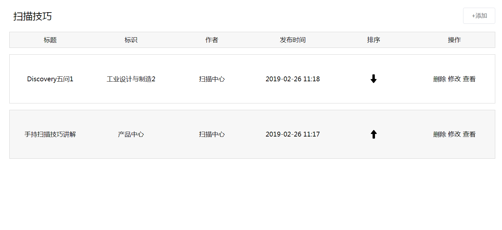
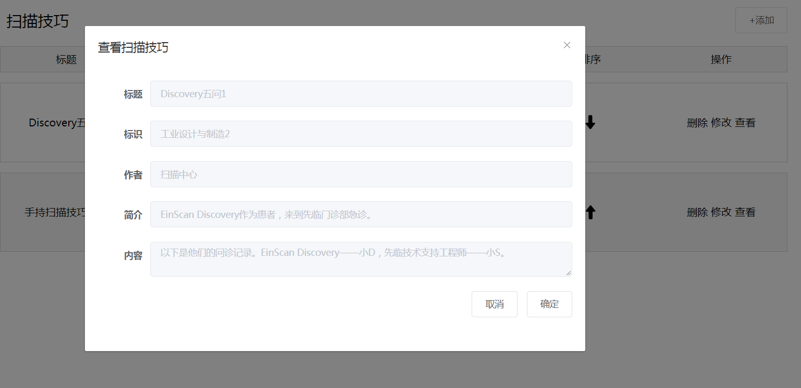
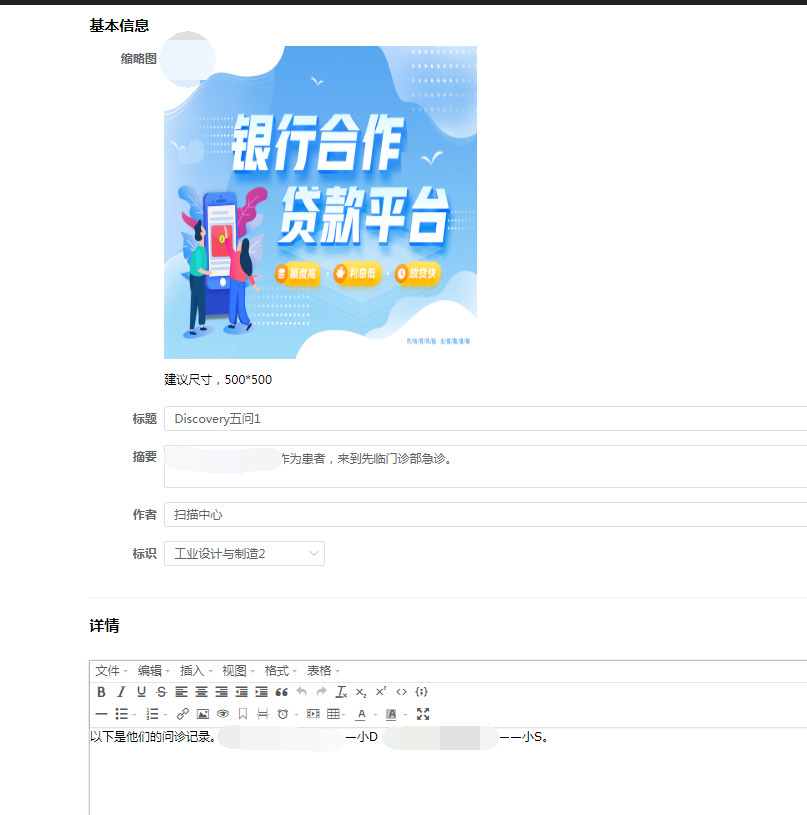

# Vue mixins实践

## 后台管理系统业务
### 列表业务图
如下一个常规的后台列表，包含列表请求，列表排序的升降，列表删除，查看（获取详情显示在dialog中）


### 使用mixins
通过mixins分发组件，将获取列表，排序的升降和删除都注入到当前。该案例是基于elment-ui的。import导入的组件请看组件篇。
::: warning
  如果你还不清楚mixins的原理，请先阅读[mixins](https://cn.vuejs.org/v2/guide/mixins.html)
:::

现在这个列表页面的逻辑只需要处理如下即可。

``` js
methods:{
   openFun(type, title, item) {
      this.basic = item;
      this.oepnDialog(type, title);//分发来的函数
    },
    saveDialog() {
      this.dialogFormVisible = false;
    },
    getListData() {
      this.getData("", getScanList);//分发来的函数，最后为接口函数
    },
    deleteFun(id) {
      this.delete("id", id, deleteScan);//分发来的函数，最后为接口函数
    },
    sortUp(id) {
      this.sort("id_first", id, ScanSortUp);//分发来的函数，最后为接口函数
    },
    sortDown(id) {
      this.sort("id_first", id, ScanSortDown);//分发来的函数，最后为接口函数
    }
}
```
该案例完整代码
``` vue

<template>
  <div class="container">
    <AppBar>
      <p slot="left" style="font-size:24px;font-weight:500">
        扫描技巧
      </p>
      <p slot="right">
        <rightButton url="/scan/scanEdit/add"> +添加</rightButton>
      </p>
    </AppBar>
    <Header class=" ">
      <el-col :span="6" slot="1"><div>标题</div></el-col>
      <el-col :span="6" slot="2"><div>标识</div></el-col>
      <el-col :span="6" slot="3"><div>作者</div></el-col>
      <el-col :span="6" slot="3"><div>发布时间</div></el-col>
      <el-col :span="6" slot="4"><div>排序</div></el-col>
      <el-col :span="6" slot="5"><div>操作</div></el-col>
    </Header>
    <Content v-for="(item, index) in list" :key="index">
      <el-col :span="6" slot="1"
        ><div>{{ item.title }}</div></el-col
      >
      <el-col :span="6" slot="2"
        ><div>{{ item.sign }}</div></el-col
      >
      <el-col :span="6" slot="3"
        ><div>{{ item.author }}</div></el-col
      >
      <el-col :span="6" slot="4"
        ><div>
          {{ (item.create_at * 1000) | timeFormatter("y-m-d_h:m") }}
        </div></el-col
      >
      <el-col :span="6" slot="5">
        <div>
          <up @sortUp="sortUp(item.id)" v-if="index !== 0"></up>
          <down
            @sortDown="sortDown(item.id)"
            v-if="index != list.length - 1"
          ></down>
        </div>
      </el-col>
      <el-col :span="6" slot="6"
        ><div>
          <span class="pointer" @click="deleteFun(item.id)">删除</span>
          <span
            class="pointer"
            @click="turnTo(`/scan/ScanEdit/${item.id}`, item)"
            >修改</span
          >
          <span class="pointer" @click="openFun('add', '查看扫描技巧', item)"
            >查看</span
          >
        </div></el-col
      >
    </Content>
    <Dialog
      :dialogFormVisible="dialogFormVisible"
      :title="dialogTitle"
      @closeDialog="closeDialog"
      @saveDialog="saveDialog"
    >
      <el-form-item label="标题">
        <el-input v-model="basic.title" disabled></el-input>
      </el-form-item>
      <el-form-item label="标识">
        <el-input v-model="basic.sign" disabled></el-input>
      </el-form-item>
      <el-form-item label="作者">
        <el-input v-model="basic.author" disabled></el-input>
      </el-form-item>
      <el-form-item label="简介">
        <el-input v-model="basic.intro" disabled></el-input>
      </el-form-item>
      <el-form-item label="内容">
        <el-input v-model="basic.content" type="textarea" disabled></el-input>
      </el-form-item>
    </Dialog>
  </div>
</template>

<script>
import Header from "@/components/Header/index";
import Content from "@/components/Content/index";
import AppBar from "@/components/AppBar";
import rightButton from "@/components/RightButton";
import dataList from "@/mixins/dataList";
import up from "@/components/SortUp";
import down from "@/components/SortDown";
import Dialog from "@/components/Dialog";
import {
  deleteScan,
  getScanList,
  ScanSortUp,
  ScanSortDown
} from "@/api/scanskill";
export default {
  mixins: [dataList],
  data() {
    return {
      url: "/list/add"
    };
  },
  components: {
    Header,
    Content,
    AppBar,
    rightButton,
    up,
    down,
    Dialog
  },
  created() {
    this.getListData();
  },
  methods: {
    openFun(type, title, item) {
      this.basic = item;
      this.oepnDialog(type, title);
    },
    saveDialog() {
      this.dialogFormVisible = false;
    },
    getListData() {
      this.getData("", getScanList);
    },
    deleteFun(id) {
      this.delete("id", id, deleteScan);
    },
    sortUp(id) {
      this.sort("id_first", id, ScanSortUp);
    },
    sortDown(id) {
      this.sort("id_first", id, ScanSortDown);
    }
  }
};
</script>

<style scoped>
</style>
```
---
编辑添加部分业务代码
---
编辑部分，常见的就是图片上传，富文本应用（见组件篇）

需要处理的逻辑如下
``` js
created() {
    this.getListData();
    if (this.$route.query.data) {
      let data = JSON.parse(this.$route.query.data);
      this.basic = data;
      this.basic.link = data.s_url;
    }
  },
  methods: {
    getListData() {
      this.getData("", getTag);
    },
    uploadSuccess(data) {
      this.$set(this.basic, "url", data.path);
      this.$set(this.basic, "img_id", data.id);
    },
    save() {
   //...处理表单逻辑
      if (this.$route.query.data) {
        this.basic.id = this.$route.params.id;
        this.editFun("data", this.basic, editScan);
      } else {
        this.addFun(this.basic, addScan);
      }
    }
  }
```
---
编辑添加部分源码
---
``` vue 
<template>
  <div class="container">
    <h2>基本信息</h2>
    <el-form label-width="120px">
      <el-form-item label="缩略图">
        <upload
          :item="basic"
          :imgUrl="basic.url"
          @emptyImgUrl="emptyImgUrl"
          @uploadSuccess="uploadSuccess"
        ></upload>
      </el-form-item>
      <el-form-item label="标题">
        <el-input
          v-model="basic.title"
          placeholder="请输入扫描技巧标题"
        ></el-input>
      </el-form-item>
      <el-form-item label="摘要">
        <el-input
          v-model="basic.intro"
          type="textarea"
          placeholder="请输入摘要"
        ></el-input>
      </el-form-item>
      <el-form-item label="作者">
        <el-input v-model="basic.author" placeholder="请输入作者"></el-input>
      </el-form-item>
      <el-form-item label="标识">
        <el-select v-model="currentSelect" placeholder="请选择案例的标识">
          <el-option
            :label="item.name"
            :value="index"
            v-for="(item, index) in list"
            :key="index"
          ></el-option>
        </el-select>
      </el-form-item>
      <div class="line"></div>
      <h2>详情</h2>
      <el-form-item> </el-form-item>
      <Tinymce ref="editor" :height="400" v-model="basic.content" />
      <div class="line"></div>
      <el-form-item>
        <el-button @click="$router.go(-1)">取消</el-button>
        <el-button @click="save">发布</el-button>
      </el-form-item>
    </el-form>
  </div>
</template>

<script>
import dataList from "@/mixins/dataList";
import upload from "@/components/UploadImg";
import Tinymce from "@/components/Tinymce";
import { editScan, addScan } from "@/api/scanskill";
import editData from "@/mixins/editData";
import { getTag } from "@/api/productCenter";
export default {
  mixins: [editData, dataList],
  components: {
    upload,
    Tinymce
  },
  data() {
    return {
      currentSelect: ""
    };
  },
  created() {
    this.getListData();
    if (this.$route.query.data) {
      let data = JSON.parse(this.$route.query.data);
      this.basic = data;
      this.basic.link = data.s_url;
    }
  },
  methods: {
    getListData() {
      this.getData("", getTag, res => {
        if (res.data.code === 200) {
          this.list = res.data.data;
          if (this.$route.query.data) {
            let data = JSON.parse(this.$route.query.data);
            this.basic = data;
            this.basic.url = data.img_url;
            this.list.forEach((v, i) => {
              if (
                v.product_genre == this.basic.product_genre &&
                v.id == this.basic.product_id
              ) {
                this.currentSelect = i;
              }
            });
          }
        }
      });
    },
    uploadSuccess(data) {
      this.$set(this.basic, "url", data.path);
      this.$set(this.basic, "img_id", data.id);
    },
    save() {
      if (!this.basic.url) {
        this.$message.error("缩略图不能为空");
        return;
      }
      if (!this.basic.title) {
        this.$message.error("标题不能为空");
        return;
      }
      if (!this.basic.intro) {
        this.$message.error("摘要不能为空");
        return;
      }
      if (!this.basic.author) {
        this.$message.error("作者不能为空");
        return;
      }
      if (this.currentSelect !== 0) {
        if (!this.currentSelect) {
          this.$message.error("标识不能为空");
          return;
        }
      }
      if (!this.basic.content) {
        this.$message.error("详情不能为空");
        return;
      }
      this.basic.product_id = this.list[this.currentSelect].id;
      this.basic.product_genre = this.list[this.currentSelect].product_genre;
      if (this.$route.query.data) {
        this.basic.id = this.$route.params.id;
        this.editFun("data", this.basic, editScan);
      } else {
        this.addFun(this.basic, addScan);
      }
    }
  }
};
</script>

<style scoped lang="scss">
.container {
  padding: 0 40px;
}
</style>
```